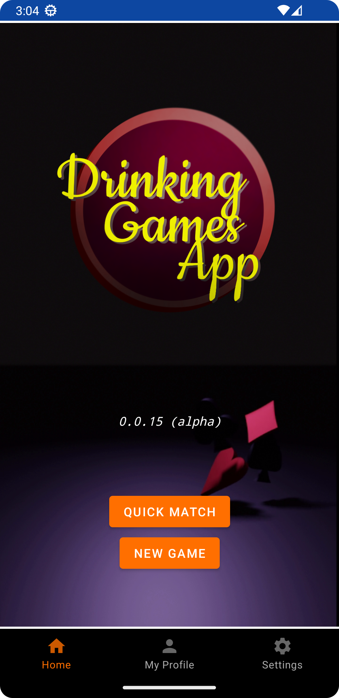
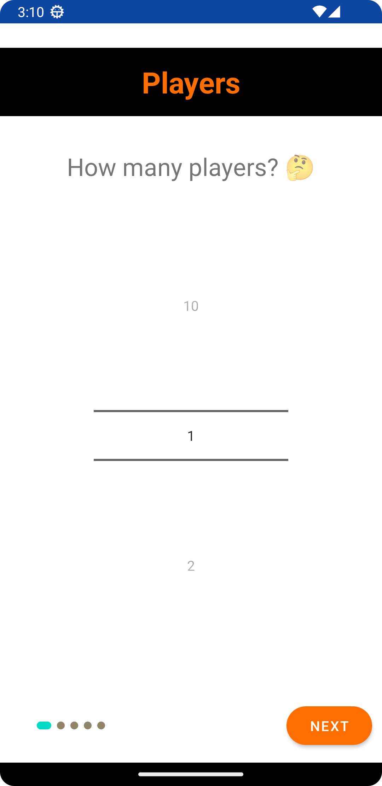
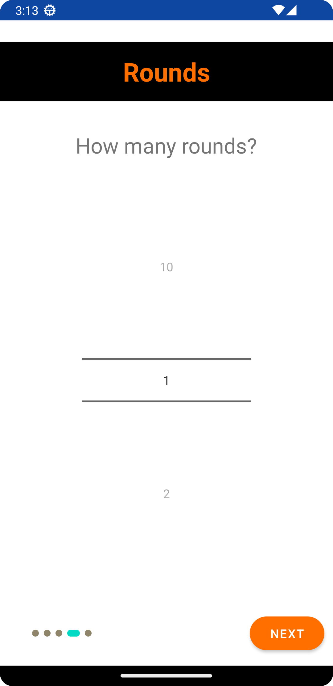

# Drinkinggamesapp

An unfinished prototype/demo/skeleton of an Android App I assembled to get some knowledge with native Android development. Build using Android Studio. Implements the Jetpack Navigation component.

## Instructions
1. Clone the repository
2. Sync Project with Gradle Files
3. Run

## Some Screenshots:

